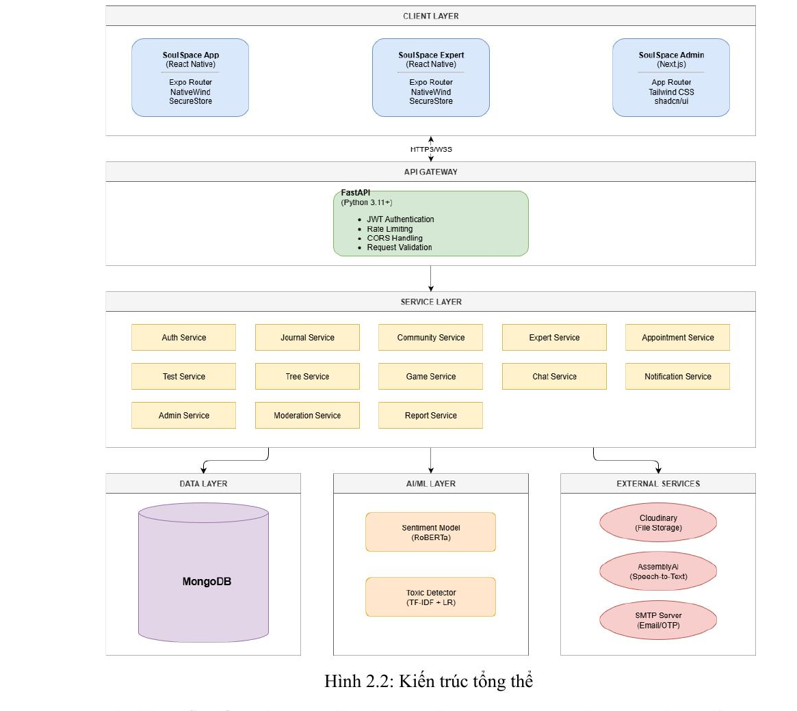
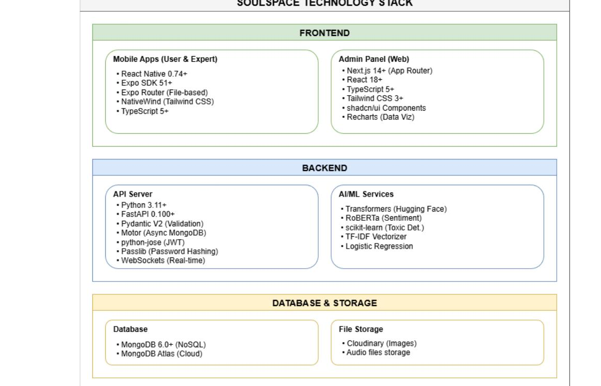

# 🌿 SoulSpace Backend

**SoulSpace** là ứng dụng hỗ trợ sức khỏe tinh thần cho Gen Z, kết hợp AI phân tích cảm xúc, cộng đồng ẩn danh, và hệ thống kết nối chuyên gia tâm lý. Repo này chứa toàn bộ Backend API cho hệ thống.

---

## 📐 System Architecture

SoulSpace Backend được xây dựng theo mô hình **Service-Based Architecture** kết hợp **Layered Architecture**, gồm các tầng: API Gateway → Service Layer → Data/AI/External Services.



### Service Layer

| Service | Chức năng |
|---|---|
| Auth Service | Đăng ký, đăng nhập, JWT |
| Journal Service | Nhật ký cảm xúc + AI phân tích |
| Community Service | Cộng đồng ẩn danh |
| Expert Service | Hồ sơ và xác minh chuyên gia |
| Appointment Service | Đặt lịch tư vấn |
| Chat Service | Realtime chat (WebSocket) |
| Test Service | Bài test tâm lý |
| Tree Service | Gamification - Mental Tree |
| Game Service | Hệ thống điểm thưởng |
| Notification Service | Push & email notification |
| Admin Service | Quản trị hệ thống |
| Moderation Service | Kiểm duyệt nội dung |
| Report Service | Xử lý báo cáo vi phạm |

---

## 🗺️ Data Flow Diagram


---

## 🛠️ Tech Stack



### Core Framework & Runtime

| Công nghệ | Phiên bản | Mục đích |
|---|---|---|
| Python | 3.11+ | Runtime |
| FastAPI | 0.100+ | Web Framework (Async, auto OpenAPI docs) |
| Uvicorn | 0.23+ | ASGI Server |
| Pydantic | 2.0+ | Data Validation & Settings |

### Database & Storage

| Công nghệ | Phiên bản | Mục đích |
|---|---|---|
| MongoDB | 6.0+ | Database chính (NoSQL, flexible schema) |
| MongoDB Atlas | Cloud | Database hosting |
| Motor | 3.3+ | Async MongoDB driver |
| Cloudinary | — | Image/Audio file storage & CDN |

### Authentication & Security

| Công nghệ | Mục đích |
|---|---|
| python-jose | JWT - Tạo và verify tokens |
| passlib (bcrypt) | Password hashing |
| python-multipart | File upload handling |

### AI/ML Services

| Công nghệ | Mục đích |
|---|---|
| Transformers (Hugging Face) | NLP pipeline |
| RoBERTa | Sentiment analysis (Nhật ký cảm xúc) |
| scikit-learn | Toxic content detection |
| TF-IDF + Logistic Regression | Text classification |
| torch | Deep learning backend |

### External Services

| Service | Mục đích |
|---|---|
| AssemblyAI | Speech-to-Text (ghi âm nhật ký) |
| SMTP Server | Email & OTP |
| Expo Push | Push notifications |

---

## ⚙️ Cài đặt & Chạy

### Yêu cầu

- Python 3.11+
- MongoDB 6.0+ (hoặc MongoDB Atlas)
- pip

### Clone và cài đặt dependencies

```bash
git clone https://github.com/your-org/soulspace-backend.git
cd soulspace-backend
python -m venv venv
source venv/bin/activate   # Windows: venv\Scripts\activate
pip install -r requirements.txt
```

### Cấu hình Environment

Tạo file `.env` từ template:

```bash
cp .env.example .env
```

Điền các biến sau vào `.env`:

```env
# Database
MONGODB_URL=mongodb+srv://<user>:<password>@cluster.mongodb.net/soulspace
DATABASE_NAME=soulspace

# JWT
SECRET_KEY=your_secret_key_here
ALGORITHM=HS256
ACCESS_TOKEN_EXPIRE_MINUTES=30

# Cloudinary
CLOUDINARY_CLOUD_NAME=your_cloud_name
CLOUDINARY_API_KEY=your_api_key
CLOUDINARY_API_SECRET=your_api_secret

# AssemblyAI
ASSEMBLYAI_API_KEY=your_assemblyai_key

# Email (SMTP)
SMTP_HOST=smtp.gmail.com
SMTP_PORT=587
SMTP_USER=your_email@gmail.com
SMTP_PASSWORD=your_app_password
```

### Chạy server

```bash
uvicorn main:app --reload --host 0.0.0.0 --port 8000
```

API docs tự động có tại: `http://localhost:8000/docs`

---

## 📂 Cấu trúc thư mục

```
soulspace-backend/
├── main.py                  # Entry point
├── core/
│   ├── config.py            # Settings & environment
│   ├── security.py          # JWT, password hashing
│   └── database.py          # MongoDB connection
├── services/
│   ├── auth/
│   ├── journal/
│   ├── community/
│   ├── expert/
│   ├── appointment/
│   ├── chat/
│   ├── test/
│   ├── tree/
│   ├── notification/
│   ├── admin/
│   ├── moderation/
│   └── report/
├── models/                  # Pydantic schemas & Beanie ODM
├── ai/
│   ├── sentiment.py         # RoBERTa sentiment pipeline
│   └── toxic_detector.py    # TF-IDF + LR toxic classifier
├── utils/
│   ├── cloudinary.py
│   ├── email.py
│   └── speech_to_text.py
└── requirements.txt
```

---

## 🤖 AI/ML Algorithms

### Sentiment Analysis (Journal)

Sử dụng mô hình **RoBERTa** (`roberta-base`, ~125M params), fine-tuned trên 58M tweets. Output là nhãn `Positive / Neutral / Negative` kèm confidence score được chuẩn hóa về `[-1.0, +1.0]`.

- **Độ chính xác:** ~85% trên benchmark
- **Lazy Loading:** Model (~500MB) load một lần lúc startup, giảm latency từ ~5s xuống ~100ms mỗi request

### Toxic Content Detection (Community)

Kết hợp **TF-IDF Vectorizer + Logistic Regression** với backup model `distilbert-base-uncased`. Hỗ trợ phát hiện nội dung độc hại trong bài đăng cộng đồng trước khi publish.

- **Độ chính xác:** ~80% bài viết toxic
- **Tối ưu hóa:** Mixed Precision (FP16) + Gradient Accumulation

### Mental Tree - Progressive Leveling

Hệ thống gamification với cơ chế XP lũy tiến:

```
Level 1 → 2: 50 XP
Level 2 → 3: 75 XP  (+25 mỗi level)
Level 3 → 4: 100 XP
...
```

Streak tracking theo ngày, Daily Throttling (1 lần tưới/ngày) để tạo thói quen tích cực.

---

## 🔌 API Endpoints chính

| Method | Endpoint | Mô tả |
|---|---|---|
| POST | `/auth/register` | Đăng ký tài khoản |
| POST | `/auth/login` | Đăng nhập, nhận JWT |
| POST | `/journal` | Tạo nhật ký cảm xúc |
| GET | `/journal` | Lấy danh sách nhật ký |
| GET | `/community/posts` | Xem bài đăng cộng đồng |
| POST | `/community/posts` | Đăng bài (có AI kiểm duyệt) |
| GET | `/experts` | Danh sách chuyên gia |
| POST | `/appointments` | Đặt lịch tư vấn |
| WS | `/ws/chat/{room_id}` | Realtime chat |
| POST | `/tree/water` | Tưới cây (Mental Tree) |
| GET | `/tests` | Danh sách bài test tâm lý |

Xem đầy đủ tại: `http://localhost:8000/docs`

---

## 👥 Team

| Thành viên | MSSV |
|---|---|
| Trần Đình Phương Linh | 22520778 |
| Đặng Thị Ngọc Minh | 22520857 |
| Nguyễn Khánh Huy | 22520566 |
| Trần Bảo Phú | 22521104 |

Môn học: **SE405 - Mobile and Pervasive Computing**  
Giảng viên hướng dẫn: **ThS. Nguyễn Tấn Toàn**  
Trường: **Đại học Công nghệ Thông tin - ĐHQG TP.HCM**
